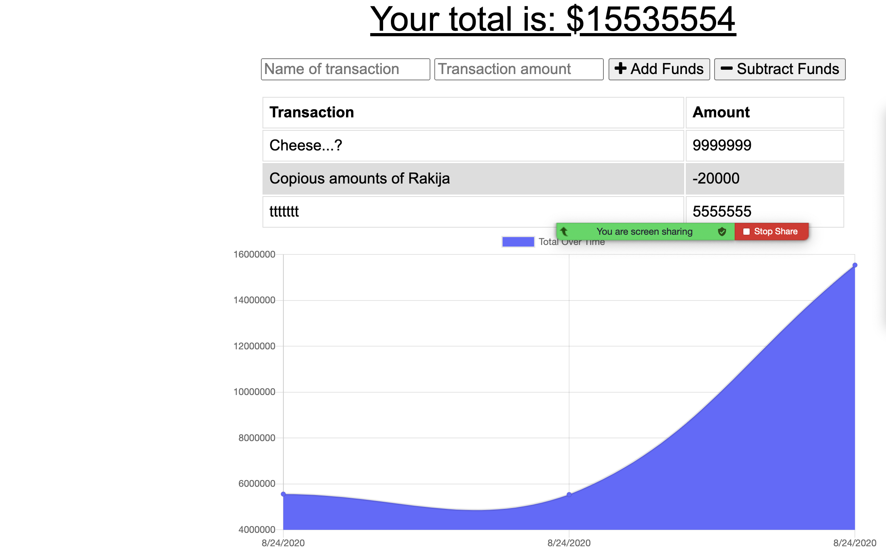

# Budget Tracker
 
## link to deployed application 
https://lit-tundra-16646.herokuapp.com/

## description
 We are allowed to add and deduct funds. Aplication is capble to save changes when we're offline and save it back after we return to online mode.
 
 ## table of content
 * [Installation](#installation)

 * [description](#description)
 
 * [usage](#usage)
 
 * [lisence](#lisence)
 
 * [contributing](#contributing)
 
 * [tests](#tests)
 
 ## installation
 npm install
 
 ## usage
 Usage is to follow the expenses and income, it's really helpful that we're able to work offline as well.
 
 ## lisence
 undefined
 
 ## contributing
 None
 
 ## tests
 npm test
 
 ## email
 senadutah@gmail.com

 ## URL
 ./assets
 
